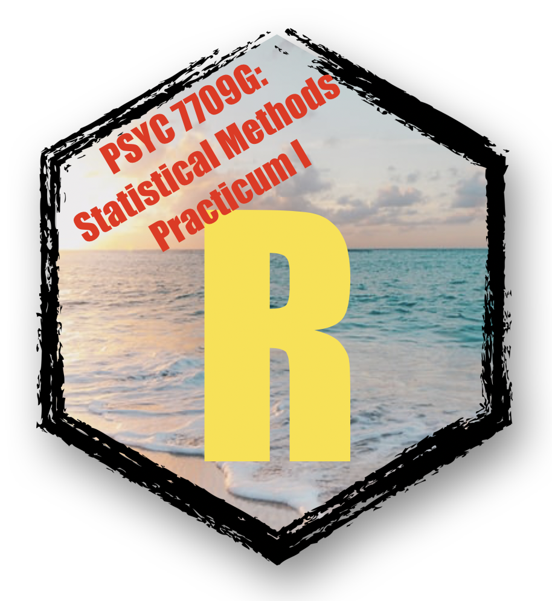

```{r setup, include=FALSE}
knitr::opts_chunk$set(echo = FALSE)

# Learn more about creating blogs with Distill at:
# https://rstudio.github.io/distill/blog.html

```


I can write my first post. And, basically just write a plain text file. 

# my first level header

Some more text could go here. I'm writing about something. It's taking a while.

## Here is a second level header

Here is some more text. Here is some more text. Here is some more text. Here is some more text. Here is some more text. Here is some more text. Here is some more text. Here is some more text. Here is some more text. 

1. This is a first thing
2. This is a second thing
3. This is a third thing

- bullet one
- bullet two
- bullet three

You can insert links like this <https://crumplab.github.io>.

Or you can insert links like this [my website](https://crumplab.github.io).

<https://www.markdownguide.org/basic-syntax/>

## citing a paper

In one example, researchers studied the Stroop effect [@algomRationalLookEmotional2004].

Blah blah blah [@verhaeghenAgingStroopEffect1998]

## pictures

```{r,out.width="50%", fig.align='center'}

```


## References


